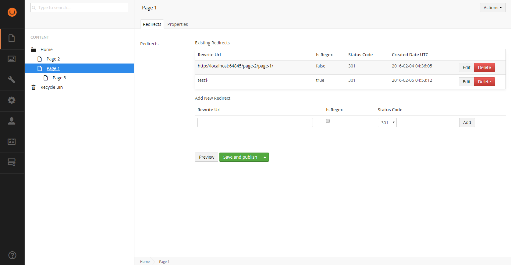

# Our.Umbraco.Bloodhound

Bloodhound is an Umbraco package designed to track when pages are moved within an Umbraco CMS instance. 

Additionally it makes it possible to assign additional 301 or 302 redirects to a node that can either be a full url or regular expression.

Currently the library supports v7.3.7+ though there's no reason why it couldn't supprt ealier versions. 

The library consists of two major components. A custom property editor `BloodhoundPropertyEditor` and `BloodhoundRewriteContentFinder`.

### BloodhoundPropertyEditor

This custom property allows the viewing, editing, addition, and deletion of url rewrites bound to whatever content node it is added to. Whenever the node is moved the previous url will
be automatically added to the rewrite collection. Rewrites can be in either standard url format or a regular expression with the option of either 301 or 302 redirect instructions.

Since all the data is stored with the content node, no additional database tables are required.

### BloodhoundRewriteContentFinder

This `IContentFinder` implementation sits in the last position before the `ContentFinderByNotFoundHandlers` and will attempt to associate the url request to a content node when all other finders
have failed. This ensures that normal requests are not intercepted and interfered with.

The login for the backoffice is:

- Username: admin
- Password: password

### TODO:
- Write Tests
- Set up and release a Nuget package.

### Concerns
I'm a little worried about the performance of the content finder and would love to find a way, maybe using Examine, to return the results.
This would be a lot easier if I could enforce the property alias the editor is assigned too.